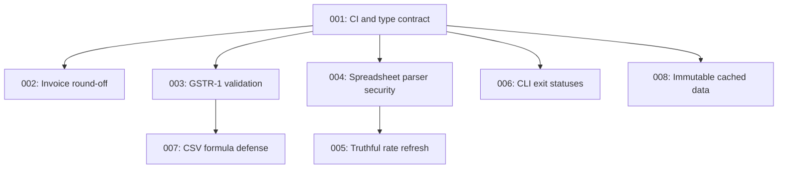

# Implementation Plans

Generated by the improve skill on 2026-08-01 against commit `a4b5782`. These plans cover the eight vetted findings from the package review. Execute them in the order below unless the dependency column says otherwise. Each executor must read its plan fully, honor its STOP conditions, and update the relevant status row when done.

## Execution order and status

| Plan | Title | Priority | Effort | Depends on | Status |
|------|-------|----------|--------|------------|--------|
| 001 | Enforce type declarations in CI and publishing | P1 | S | — | DONE (reviewed at `470eacc`) |
| 002 | Support downward invoice round-off safely | P1 | S | 001 | DONE (reviewed at `17b497a`) |
| 003 | Reject invalid GSTR-1 summary inputs | P1 | M | 001 | DONE (reviewed at `0eecfe0`) |
| 004 | Replace vulnerable spreadsheet parsers | P1 | M | 001 | DONE (reviewed at `9b8f9b7`) |
| 005 | Make GST rate refreshes fail closed and truthful | P1 | M | 004 | DONE (reviewed at `4aad2b8`) |
| 006 | Return failing CLI statuses for invalid identifiers | P2 | S | 001 | DONE (reviewed at `818a386`) |
| 007 | Prevent spreadsheet formulas in CSV exports | P2 | S | 003 | DONE (reviewed at `02dc29f`) |
| 008 | Prevent mutation of cached public datasets | P2 | M | 001 | DONE (reviewed at `f0b27f2`) |

Status values: `TODO` | `IN PROGRESS` | `DONE` | `BLOCKED (<reason>)` | `REJECTED (<reason>)`

## Dependency notes

- Plan 001 lands first because it makes the existing TypeScript smoke test a required merge and release gate; later plans change public declarations.
- Plans 002 and 003 are independent after 001 and should land before rate-pipeline work because they correct monetary outputs already exposed to consumers.
- Plan 004 upgrades both spreadsheet-reading paths before plan 005 continues processing downloaded rate files.
- Plan 005 depends on 004 so its stricter remote-ingestion tests run against the supported parser rather than vulnerable npm-registry releases.
- Plan 007 follows plan 003 because both edit `export.js`, `tests/export.test.js`, `index.d.ts`, and `tests/types.test.ts`; sequencing avoids merge conflicts and preserves the typed GSTR-1 contract.
- Plan 008 follows plan 001 because it changes collection mutability in the public TypeScript declarations.

## Repository-wide verification baseline

Run these after every completed plan:

| Purpose | Command | Expected result |
|---------|---------|-----------------|
| Install | `npm ci` | exit 0 |
| Tests | `npm test -- --runInBand` | exit 0; all suites pass |
| Types | `npm run typecheck` | exit 0; no TypeScript errors |
| Syntax | `for f in index.js gst.js gstin.js sac.js export.js bin/cli.js scripts/*.js; do node --check "$f" || exit 1; done` | exit 0; no output |
| Publish contents | `npm pack --dry-run` | exit 0; expected runtime files only |

The audit environment did not have `node_modules`, so Jest and TypeScript could not be executed when these plans were authored. JavaScript syntax checks, data invariants, direct runtime probes, and `npm pack --dry-run` succeeded.

## Findings considered and rejected

- Chapter-level GST rates were not treated as a defect by themselves because the README explicitly describes them as best-effort chapter classifications and warns users to verify official notifications. Plan 005 addresses misleading freshness and automation behavior without pretending the fallback is exact.
- CommonJS-only packaging was not planned: no repository evidence showed that ESM support is currently blocking consumers.
- The 5.7 MB unpacked dataset and linear exact lookups were not planned in this batch. They are legitimate optimization opportunities, but tax correctness, ingestion security, and API safety have higher leverage.
- Metadata version `2.3.0` differing from package version `2.3.1` was not treated as a defect because the field can reasonably describe the dataset rather than the npm release. Plan 005 must clarify this distinction rather than silently coupling the versions.
